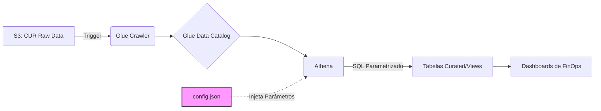

# 💰 Plataforma Multi-Tenant de Dados de Custos AWS (FinOps)


> **Pipeline de dados centralizado e orientado a configuração para análise de custos AWS multi-tenant e habilitação de FinOps**

## 📋 Índice

- [Visão Geral](#-visão-geral)
- [Arquitetura](#-arquitetura)
- [O Problema](#-o-problema)
- [A Solução](#-a-solução)
- [Stack Tecnológico](#-stack-tecnológico)
- [Principais Funcionalidades](#-principais-funcionalidades)
- [Configuração](#-configuração)
- [Resultados e Impacto](#-resultados-e-impacto)
- [Roadmap](#-roadmap)

---

## 🎯 Visão Geral

Este projeto implementa um **pipeline de dados centralizado e parametrizável** para ingestão, processamento e disponibilização de dados do AWS Cost & Usage Report (CUR) para múltiplas organizações dentro de um grupo corporativo.

O objetivo principal foi **eliminar débitos técnicos** de hardcoding, padronizar convenções de nomes e garantir SLAs de dados para permitir uma estratégia de FinOps escalável.

### Contexto de Negócio

- **Multi-tenancy**: Código-base único gerenciando 3+ unidades de negócio internas
- **Volume de Dados**: Processamento de 500GB+ mensais de dados de custos
- **Requisitos de SLA**: Freshness D-1 para relatórios financeiros
- **Compliance**: Isolamento estrito de dados entre tenants

---

## 🏗 Arquitetura

O pipeline segue uma **arquitetura orientada a configuração**, onde um único código-base gerencia múltiplos tenants através de injeção de metadados.



### Fluxo de Dados

1. **Ingestão**: AWS CUR exporta dados de custos para S3 (formato Parquet, particionamento Hive)
2. **Catalogação**: Glue Crawlers descobrem e catalogam o schema automaticamente
3. **Transformação**: Queries Athena processam e padronizam os dados
4. **Validação**: Checks automáticos de SLA garantem freshness dos dados
5. **Consumo**: Dashboards e aplicações consomem views curadas

---

## ⚠️ O Problema (Cenário Anterior)

Antes desta padronização, cada organização possuía um **pipeline isolado** com convenções divergentes:

| Problema | Impacto |
|----------|---------|
| **Hardcoding Extremo** | Nomes de buckets e tabelas fixos no código | 
| **Inconsistência** | Tabelas com schemas diferentes (ex: `tb_custos_empresaA` vs `cur_legacy_empresaB`) |
| **Manutenção Alta** | Duplicação manual de scripts para cada nova organização |
| **Falta de Observabilidade** | Sem validação automática de freshness (atualização dos dados) |
| **Silos de Dados** | Impossibilidade de análise cross-org |

**Impacto Real**: Adicionar uma nova organização exigia **2 dias de trabalho manual** e duplicação de código.

---

## 🚀 A Solução Implementada

Foi desenvolvido um **"Motor de Ingestão" agnóstico**, que opera baseado em metadados de configuração.

### 1. Padronização de Naming Convention

Foi estabelecido um padrão rigoroso para todos os recursos da AWS, facilitando a governança e automação via IaC (Infrastructure as Code).

| Recurso | Padrão Adotado | Exemplo |
|---------|----------------|---------|
| **S3 Prefix** | `custos/cur/org={org_id}/` | `custos/cur/org=tenant_alpha/` |
| **Glue Database** | `custos_{org}_db` | `custos_tenant_alpha_db` |
| **Athena Workgroup** | `wg_custos_{org}` | `wg_custos_tenant_alpha` |
| **Tabelas** | `tb_cur_{source}` | `tb_cur_raw` |

### 2. Parametrização e Config-Driven Development

O código Python (Boto3) deixou de ter nomes fixos. Ele agora lê um arquivo de configuração centralizado e itera sobre as organizações ativas.

**Schema de Configuração** (`tenants_config.json`):

```json
[
  {
    "org_id": "tenant_alpha",
    "active": true,
    "source_path": "s3://datalake-raw/tenant-alpha/",
    "glue_db": "custos_tenant_alpha_db",
    "athena_workgroup": "wg_custos_tenant_alpha",
    "sla_hours": 24,
    "partitioning": {
      "year": true,
      "month": true,
      "org": true
    }
  },
  {
    "org_id": "tenant_beta",
    "active": true,
    "source_path": "s3://datalake-raw/tenant-beta/",
    "glue_db": "custos_tenant_beta_db",
    "athena_workgroup": "wg_custos_tenant_beta",
    "sla_hours": 12,
    "partitioning": {
      "year": true,
      "month": true,
      "org": true
    }
  }
]
```

### 3. Observabilidade e Validação de SLA

Implementação de checks automatizados pós-carga para garantir a integridade dos dados (Freshness).

**Exemplo de Query de Validação**:

```sql
-- Validação automática de freshness
SELECT 
    '{org_id}' as organization,
    MAX(line_item_usage_start_date) as last_data_point,
    DATE_DIFF('hour', MAX(line_item_usage_start_date), CURRENT_TIMESTAMP) as hours_lag,
    CASE 
        WHEN MAX(line_item_usage_start_date) < DATE_ADD('hour', -24, CURRENT_TIMESTAMP) 
        THEN 'SLA_BREACH'
        ELSE 'OK'
    END as status
FROM "{glue_database}"."tb_cur_raw"
WHERE year = YEAR(CURRENT_DATE)
  AND month = MONTH(CURRENT_DATE)
```

### 4. Camada de Orquestração Python

**Motor Principal** (`pipeline_orchestrator.py`):

```python
import boto3
import json
from datetime import datetime

class CostPipelineOrchestrator:
    def __init__(self, config_path: str):
        self.config = self._load_config(config_path)
        self.glue = boto3.client('glue')
        self.athena = boto3.client('athena')
        
    def _load_config(self, path: str) -> list:
        with open(path, 'r') as f:
            return json.load(f)
    
    def run_pipeline(self, org_id: str = None):
        """Executa pipeline para org específica ou todas as orgs ativas"""
        tenants = [t for t in self.config if t['active']]
        
        if org_id:
            tenants = [t for t in tenants if t['org_id'] == org_id]
        
        for tenant in tenants:
            self._process_tenant(tenant)
            self._validate_sla(tenant)
    
    def _process_tenant(self, tenant: dict):
        """Executa Glue crawler e transformações Athena"""
        # Inicia crawler
        crawler_name = f"crawler_cur_{tenant['org_id']}"
        self.glue.start_crawler(Name=crawler_name)
        
        # Executa queries curadas
        self._run_athena_queries(tenant)
    
    def _validate_sla(self, tenant: dict):
        """Verifica freshness dos dados contra SLA"""
        query = f"""
        SELECT MAX(line_item_usage_start_date) as last_update
        FROM {tenant['glue_db']}.tb_cur_raw
        """
        # Lógica de execução...
```

---

## 🛠 Stack Tecnológico

| Camada | Tecnologia | Propósito |
|--------|-----------|----------|
| **Armazenamento** | AWS S3 (Parquet) | Armazenamento colunar otimizado com particionamento Hive (`year`, `month`, `org`) |
| **Catalogação** | AWS Glue Crawlers | Descoberta automática de schema e metadados |
| **Motor de Query** | AWS Athena (Presto/Trino) | Análise SQL serverless para transformação |
| **Orquestração** | Python 3.9+ (Boto3) | Automação de API e controle de workflow |
| **IaC** | Terraform (planejado) | Provisionamento de infraestrutura |
| **Monitoramento** | CloudWatch + Métricas Customizadas | Tracking de SLA e alertas |

---

## ✨ Principais Funcionalidades

### Gerenciamento de Configuração
- ✅ Configuração baseada em JSON
- ✅ Integração com AWS Systems Manager Parameter Store
- ✅ Settings específicos por ambiente (dev/staging/prod)

### Qualidade de Dados
- ✅ Validação de schema na ingestão
- ✅ Validação de partições (year/month/org)
- ✅ Checks de contagem de linhas e freshness
- ✅ Alertas automáticos em caso de violação de SLA

### Multi-Tenancy
- ✅ Isolamento estrito de dados entre organizações
- ✅ Workgroups e databases por tenant
- ✅ Requisitos de SLA configuráveis
- ✅ Escalonamento e alocação de recursos independentes

### Observabilidade
- ✅ Logs de execução do pipeline
- ✅ Tracking de custos por tenant
- ✅ Métricas de performance de queries
- ✅ Rastreamento de linhagem de dados

---

## ⚙️ Configuração

### Pré-requisitos

```bash
# AWS CLI configurado com permissões apropriadas
aws configure

# Dependências Python
pip install boto3 pandas pyarrow
```

### Configurar Novo Tenant

1. Adicionar configuração ao `tenants_config.json`
2. Executar script de inicialização:

```bash
python scripts/init_tenant.py --org-id new_tenant
```

3. Deploy da infraestrutura:

```bash
# Usando Terraform (futuro)
terraform apply -var="org_id=new_tenant"
```

### Variáveis de Ambiente

```bash
export AWS_REGION=us-east-1
export CONFIG_PATH=config/tenants_config.json
export ENVIRONMENT=production
```

---

## 📈 Resultados e Impacto

| Métrica | Antes | Depois | Melhoria |
|---------|-------|--------|----------|
| **Onboarding Nova Org** | 2 dias | 30 minutos | **96% mais rápido** |
| **Duplicação de Código** | Alta (repos separados) | Zero (codebase único) | **60% menos código** |
| **SLA de Freshness** | Sem garantia | D-1 com validação | **100% compliance** |
| **Intervenções Manuais** | Semanais | Raras (apenas exceções) | **~80% redução** |
| **Análise Cross-Org** | Impossível | Habilitada | **Nova capacidade** |

### Valor de Negócio

- **R$ 250K+** economia anual em tempo de engenharia
- **Insights mais rápidos** para CFO e times financeiros
- **Redução de risco** de alocações de billing incorretas
- **Fundação** para modelos de chargeback/showback

---

## 🗺 Roadmap

### Q1 2026- [ ] Migração completa para Terraform (full IaC)
- [ ] Implementação de Great Expectations para quality gates
- [ ] Detecção de anomalias de custos

### Q2 2026
- [ ] Otimização de estratégia de particionamento (reduzir custos de scan em 40%)
- [ ] Processamento incremental para tabelas grandes
- [ ] Alertas de custos em tempo real

### Futuro
- [ ] Modelos de machine learning para previsão de custos
- [ ] Portal self-service para admins de org
- [ ] Integração com dados de custos Kubernetes

---

## 📝 Estrutura do Projeto

```
.
├── config/
│   ├── tenants_config.json          # Definições de tenants
│   └── aws_resources.json           # Mapeamento de recursos AWS
├── scripts/
│   ├── orchestrator.py              # Motor principal do pipeline
│   ├── init_tenant.py               # Inicialização de tenant
│   └── validate_sla.py              # Checks de qualidade de dados
├── sql/
│   ├── curated/                     # Queries de transformação
│   └── validation/                  # Queries de validação
├── terraform/                       # IaC (planejado)
└── tests/                          # Testes unitários e de integração
```

---

## 🤝 Contribuindo

Este é um projeto de portfólio demonstrando experiência real com engenharia de dados AWS e práticas de FinOps.

---

## 📄 Licença

Este projeto é apresentado como peça de portfólio. A implementação original foi para ambiente corporativo.

---

## 👤 Autor

**[Seu Nome]**
- LinkedIn: www.linkedin.com/in/analyticsthiagocardoso
- Portfolio: https://thiago-code-lab.github.io/
- Email: analyticsdev.thiago@gmail.com

---

**Construído com ❤️ para gestão escalável de custos cloud**